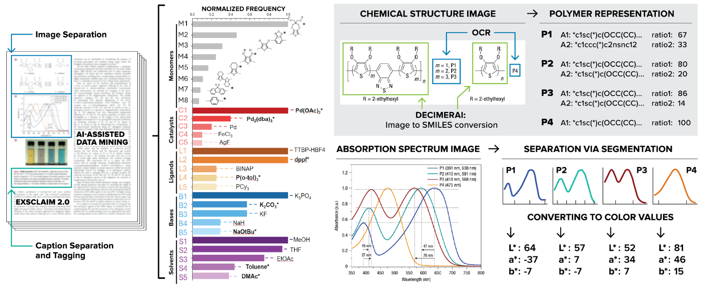
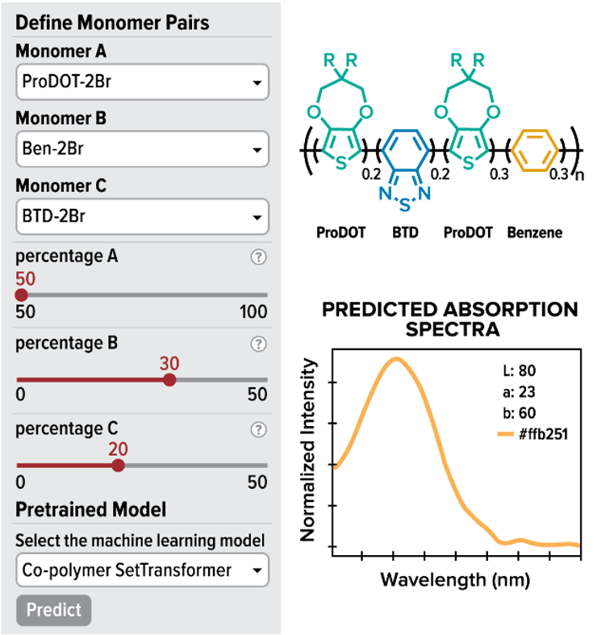

# EPoly_LitMining_ColorPred

Demos and supporting data for literature mining and color prediction of electrochromic polymers (ECPs) to enable autonomous experimentation.

# Installation

We recommend installing the package by following the instructions below.

```
conda create --name env-ecp python=3.12
conda activate env-ecp
git clone https://github.com/polybot-nexus/EPoly_LitMining_ColorPred.git
cd EPoly_LitMining_ColorPred
python -m pip install -r requirements.txt
```

# Demostrations

## Demo 1: Literature Mining workflow

Large language model (LLM) assisted extraction of chemical information. See [```demo1.ipynb```](demo1.ipynb).

[](demo1.ipynb)

## Demo 2: ECPs color prediction webapp

A transformer model for predicting CIELab and Absorption spectra of ECPs. Visit <https://polybot-ecps.streamlit.app/>.

[](https://polybot-ecps.streamlit.app/)

## Other Demostrations
- [```database_analysis.ipynb```](database_analysis.ipynb) Plotting the statistics on our database and analysing the trends.
- [```model_comparison.ipynb```](model_comparison.ipynb) Comparison of several models on literature data.

# Train your own models based on the prefered monomer representation

To train your own models you can refer to the co-polymer-set-transformer repository: 

https://github.com/polybot-nexus/co-polymer-set-transformer


